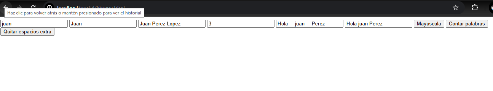

# Libreria_Espacios

## Instituto Tecnológico de Oaxaca

**Estudiantes:**  
- Rodríguez Hernández Alexa Isabel  
- Jiménez Osorio Christopher Martín  

**Equipo 8** 

**Materia:** Programación Web  
**Tarea:** Librería 
**Periodo:** Verano 2025  

#### **Instalación**
Incluirla en un .html con la siguiente nomenclatura 

#### **Uso**
Uso en HTML
<!DOCTYPE html>
<html lang="es">

<head>
  <meta charset="UTF-8">
  <title>Prueba TextoUtils</title>
</head>

<body>
  <input type="text" id="nombre">
  <input type="text" id="resultadomayuscula">
  <input type="text" id="contar">
  <input type="text" id="resultadocontar">
  <input type="text" id="espacios">
  <input type="text" id="resultadoespacios">
  
  <button onclick="resultadomayuscula()">Enviar</button>
  <button onclick="resultadocontar()">Contar palabras</button>
  <button onclick="resultadoespacios()">Quitar espacios extra</button>

  

  
  
  
</body>

</html>

#### **Capturas de pantalla**

#### Video 
https://drive.google.com/drive/folders/1AlFHFEs91bzrxFTpVgxhVvLXxSc1wu9u?usp=sharing
